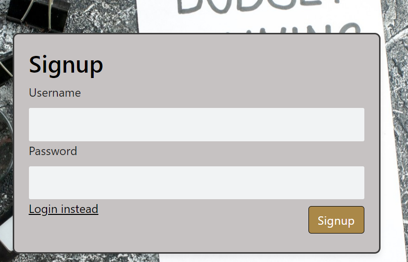
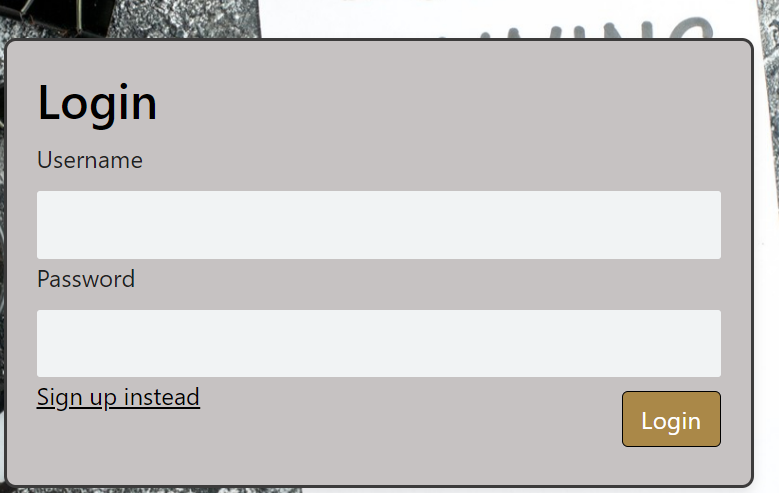
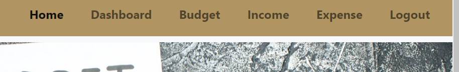

# Finance Handlers

Finance Handler
https://finance-handlers.onrender.com/home

The application is designed for users to easily add their income streams, as well as their expenditures allowing them to easily keeping track of their profits/losses/savings. 
The application also allows users to not only categorize expenditure, but also customize their calendar for better tracking of timelines alongside their cash flow.

To use the finance handlers app, simply create login credentials, make sure to use a password with at least 8 characters!

You can know use these credentials to access the app at any time

From the homepage, you can navigate to the dashboard, budget, income, or expense pages.  

